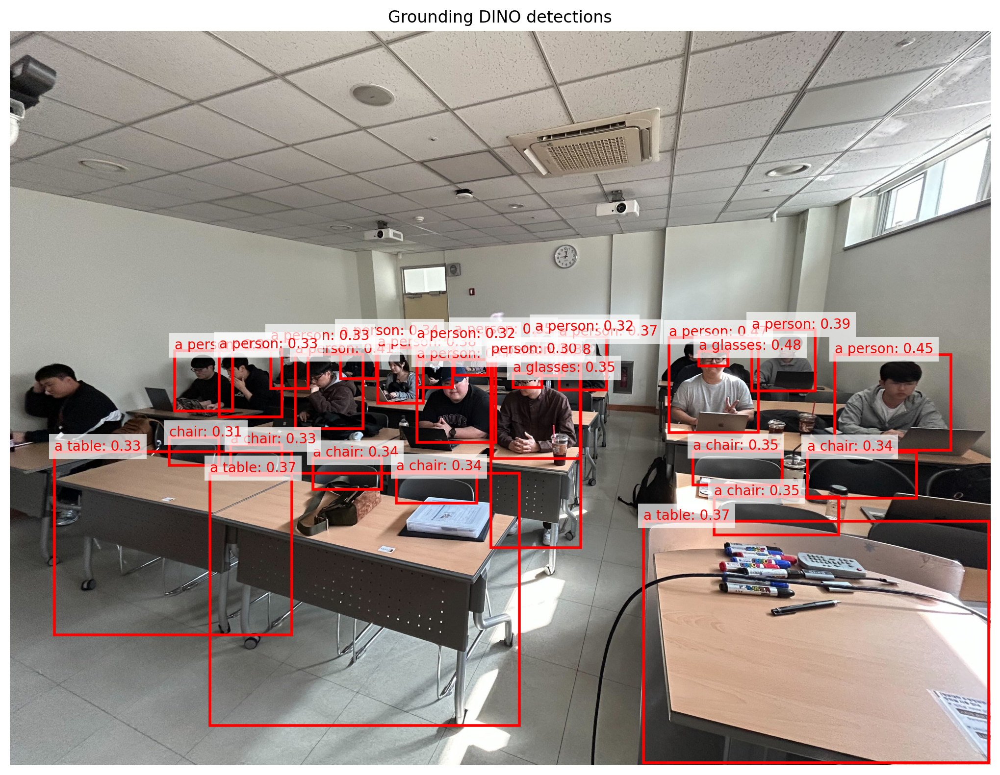

# Deep Learning Mid-term Assignment

Three Hugging Face vision foundation model demos: object detection, selected-target segmentation, and visual question answering.

## Setup

```bash
git clone https://github.com/junwon0901/foundation-models-midterm.git
cd foundation-models-midterm
```

Using Conda:

```bash
conda create -n 2026010688 python=3.10 -y
conda activate 2026010688
python -m pip install --upgrade pip
python -m pip install -r requirement.txt
```

Using venv:

```bash
python3 -m venv .venv
source .venv/bin/activate
python -m pip install --upgrade pip
python -m pip install -r requirement.txt
```

CUDA example:

```bash
python -m pip install torch torchvision --index-url https://download.pytorch.org/whl/cu121
python -m pip install -r requirement.txt
```

## Run with helper script

```bash
chmod +x run.sh

./run.sh grounding-dino
./run.sh sam2
./run.sh qwen3-vl
```

The helper script is optional. The same demos can also be run directly:

```bash
python Grounding-DINO.py
python SAM2-base-plus.py
python Qwen3-VL-8B-Instruct.py
```

## Usage

### Grounding DINO

- Model: `IDEA-Research/grounding-dino-base`
- Task: open-vocabulary object detection
- Input: `samples/xai506_example_image.jpg`
- Prompt: `a glasses. a person. a chair. a table.`
- Output: `result/Grounding-DINO-base_result.png`

### SAM2

- Model: `facebook/sam2-hiera-base-plus`
- Task: selected-target segmentation
- Input: `samples/xai506_example_image.jpg`
- Left click: select one object/person to mask
- Right click: exclude another object/person or background
- Backspace: undo
- Enter: run segmentation
- Output: `result/SAM2-base-plus_result.png`

### Qwen3-VL

- Model: `Qwen/Qwen3-VL-8B-Instruct`
- Task: visual question answering
- Input: `samples/xai506_example_image.jpg`
- Question: `How many people are in this image?. Answer in one sentence.`
- Output: terminal text

## Results

### Grounding DINO Base



### SAM2 Hiera Base Plus


## Notes

- First run downloads model weights.
- Grounding DINO and SAM2 require a display for Matplotlib windows.
- Qwen3-VL 8B is heavy; CUDA is recommended.
